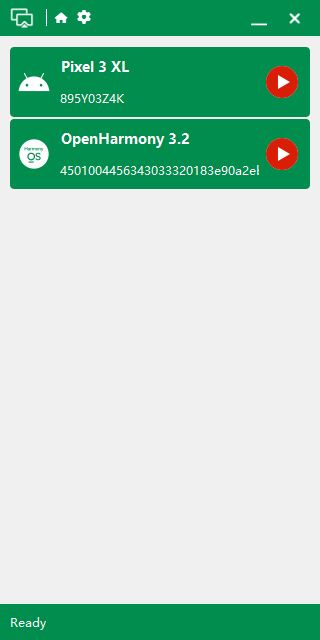
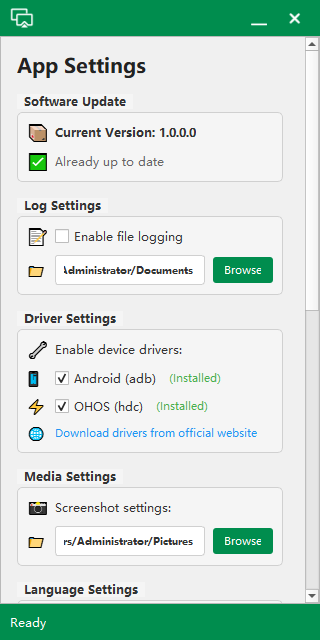
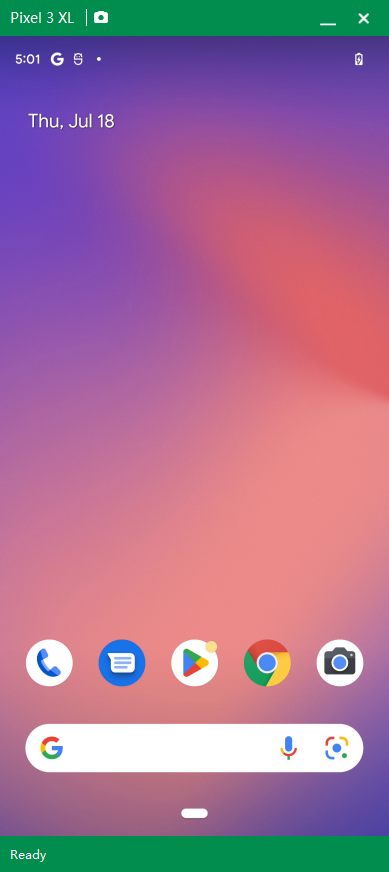
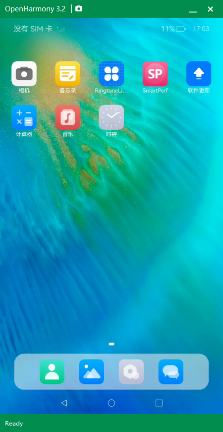

# ScreenCast

> 🚀 **跨平台设备投屏工具** - 支持 Android 和开源鸿蒙的免费投屏解决方案

**完全免费 · 开源鸿蒙支持 · 高清投屏 · 跨平台运行**

[🚀 快速开始](docs/quickstart.md) · [🏗️ 架构设计](docs/architecture.md) · [🔧 开发指南](docs/development.md) · [🗓️ 版本计划](docs/roadmap.md) · [💝 捐赠支持](docs/donation.md)

---

## 📖 项目介绍

ScreenCast 是一个基于 Qt 6 开发的跨平台投屏工具，支持 Android 和 OpenHarmony 设备。项目采用现代化的架构设计，提供高清、流畅的投屏体验。

### 🎯 核心优势
- **完全免费**: 开源免费，无任何收费功能
- **开源鸿蒙**: 首家支持 OpenHarmony 投屏
- **跨平台**: Windows、macOS、Linux 全平台支持
- **高清画质**: 支持设备原生分辨率投屏
- **现代化界面**: 简洁美观的界面设计

### 🚀 技术特点
- **Qt 6 框架**: 现代化的跨平台 GUI 框架
- **模块化架构**: 清晰的模块化设计，易于扩展
- **插件系统**: 支持第三方插件扩展功能
- **性能优化**: 多线程处理，硬件加速支持

## 🖼️ 界面展示

### 主界面/设置界面/投屏界面

## 📱 功能特性

### 🎯 核心功能
- **设备支持**: Android 5.0+ 和 OpenHarmony 设备
- **高清投屏**: 支持原生分辨率投屏
- **实时控制**: 鼠标点击、拖拽、滚轮操作
- **设备管理**: 智能发现、重命名、置顶
- **截图功能**: 一键截图保存
- **多窗口**: 支持同时投屏多个设备

### 🚀 技术特性
- **跨平台**: Windows、macOS、Linux 全平台支持
- **性能优化**: 硬件加速、多线程处理、内存优化
- **架构设计**: 模块化架构、插件系统、API 接口
- **智能功能**: 设备识别、性能优化、错误诊断

### 🎨 用户体验
- **现代化界面**: 简洁设计、响应式布局、动画效果
- **人性化操作**: 一键操作、智能提示、快捷键支持

### 🛡️ 安全隐私
- **数据安全**: 本地存储、加密传输、权限控制
- **隐私保护**: 无数据收集、透明开源、本地处理

## 📊 与竞品对比

| 特性 | ScreenCast | scrcpy | Vysor |
|------|------------|--------|-------|
| **价格** | 🆓 完全免费 | 🆓 免费 | 💰 付费 |
| **开源鸿蒙** | ✅ 首家支持 | ❌ 不支持 | ❌ 不支持 |
| **跨平台** | ✅ 全平台 | ✅ 全平台 | ✅ 全平台 |
| **高清画质** | ✅ 原生分辨率 | ✅ 高分辨率 | ⚠️ 压缩画质 |
| **界面设计** | ✅ 现代化 | ⚠️ 命令行 | ✅ 现代化 |
| **易用性** | ✅ 一键操作 | ⚠️ 需要命令行 | ✅ 简单易用 |
| **扩展性** | ✅ 插件架构 | ⚠️ 有限 | ❌ 封闭 |
| **社区支持** | ✅ 活跃社区 | ✅ 活跃社区 | ⚠️ 有限 |

## 🤝 社区支持

### 反馈建议
- 🐛 [报告 Bug](https://github.com/frankzhangv5/ScreenCast/issues)
- 💡 [功能建议](https://github.com/frankzhangv5/ScreenCast/discussions)
- 💬 [社区讨论](https://github.com/frankzhangv5/ScreenCast/discussions)

### 贡献代码
如果您想为项目贡献代码，请参考 [开发指南](docs/development.md)。

## 💝 支持项目

### 捐赠支持
您的捐赠将直接用于项目发展：
- 🚀 加速新功能开发
- 🧪 购买更多设备进行测试
- 📚 完善文档和教程
- 🌐 升级服务器和基础设施
- 🎯 建设更好的开发者社区

[查看捐赠详情](docs/donation.md)

## 📄 许可证

ScreenCast 采用 **MIT 许可证**，这是一个宽松的开源许可证，允许您自由使用、修改和分发代码。

[查看完整许可证](docs/license.md)

## 🙏 致谢

感谢所有为 ScreenCast 项目做出贡献的开发者、测试者和用户！

### 核心贡献者
- [张峰] - 核心开发者
- [张峰] - 架构设计师
- [张峰] - 测试负责人

### 特别感谢
- **Qt 团队**: 提供优秀的跨平台框架
- **FFmpeg 团队**: 提供强大的多媒体处理库
- **OpenHarmony 团队**: 提供开源鸿蒙生态
- **开源社区**: 提供宝贵的建议和支持

---

**ScreenCast 致力于为用户提供最优质的投屏体验，我们将持续创新和完善功能，为用户创造更多价值。**

**⭐ 如果这个项目对您有帮助，请给我们一个 Star！**

 